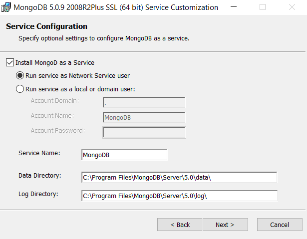
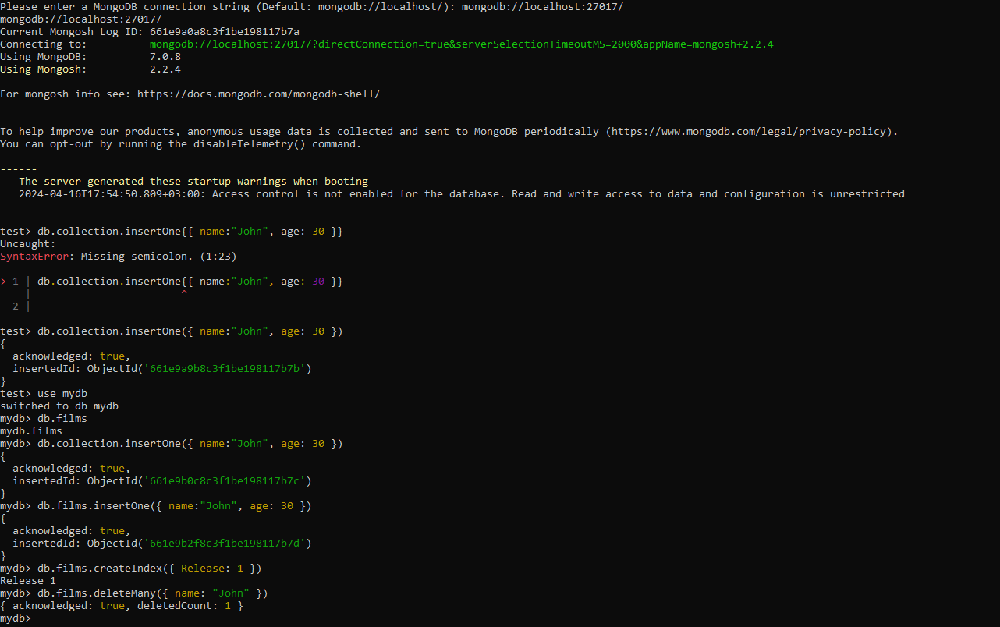
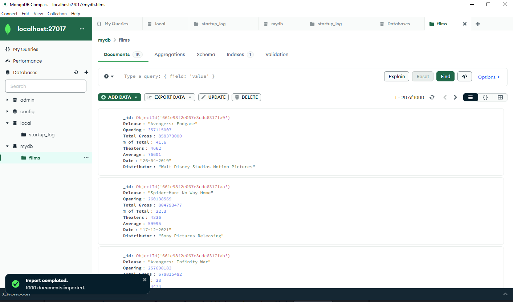
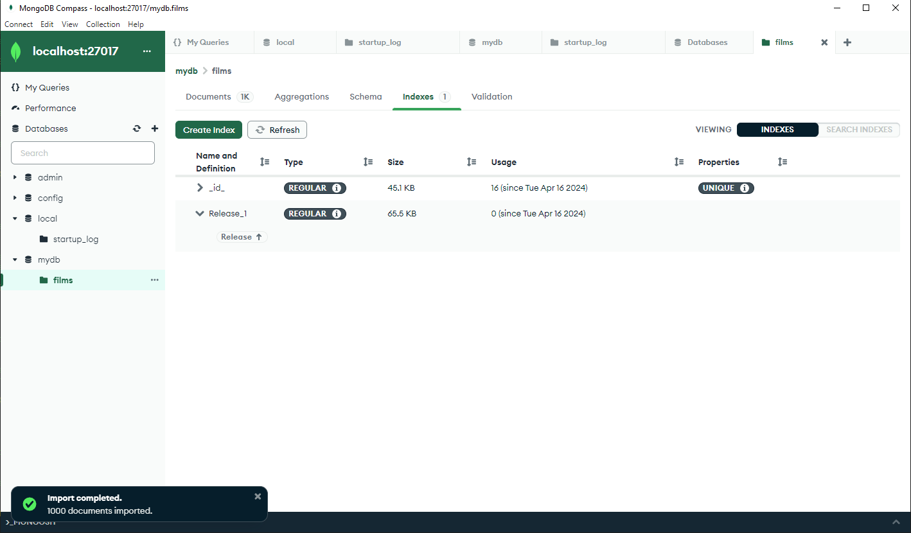

## 🎯 Lab 3: MongoDB Data Model Analysis and Scalability Study

### 📚 Objective
- Анализ дата-модели MongoDB
- Исследование горизонтальной масштабируемости и высокой доступности функций

### 📝 Report

#### 👩‍💻👨‍💻 Task 1: Installing MongoDB

#### 👩‍💻👨‍💻 Task 2: Obtaining and Adding a Dataset
За основу был выбран датасет с лучшими фильмами за все времена. К сожалению, скриншоты его добавления отсутствуют на данный момент.

#### 👩‍💻👨‍💻 Task 3: Exploring MongoDB Features
**Модель документа**
Документы сгруппированы в сборники. Однако документы в одной коллекции необязательно должны иметь точно такой же набор полей. Это то, что мы называем "гибкой схемой." Эта гибкость позволяет разработчикам быстрее выполнять итерацию и переносить данные между различными схемами без простоев. Однако, если вы хотите заблокировать свою схему в определенный момент, вы можете сделать это, применив к коллекциям правила проверки.
**Шардинг**
Разделение в MongoDB позволяет гораздо большую горизонтальную масштабируемость. Горизонтальное масштабирование означает, что каждый осколок в каждом кластере содержит часть данного набора данных, по сути, функционирующего как отдельная база данных. Комбинирование данных распределенных шардов образует единую, всеобъемлющую базу данных, которая гораздо лучше подходит для удовлетворения потребностей популярного, растущего приложения с нулевым временем простоя.
**Репликация**
Репликация позволяет обойти эти уязвимости, развертывая несколько серверов для аварийного восстановления и резервного копирования. Горизонтальное масштабирование между несколькими серверами значительно повышает доступность данных, надежность и отказоустойчивость. Потенциально, репликация может помочь распространить нагрузку чтения на вторичные члены набора реплик с использованием предпочтения чтения.
**Аутентификация**
MongoDB предоставляет ряд механизмов аутентификации для доступа пользователей к базе данных. Наиболее распространенным является механизм проверки подлинности с ответом на вызов (SCRAM), который используется по умолчанию. При использовании SCRAM пользователь должен предоставить базу данных аутентификации, имя пользователя и пароль.
**Триггеры баз данных**
Триггеры баз данных являются отличным способом для проведения аудита, обеспечения согласованности данных и целостности данных, а также для выполнения сложной обработки событий. Ознакомьтесь со статьей, посвященной триггерам баз данных, чтобы узнать больше о различных типах триггеров и о том, как их использовать.

#### 👩‍💻👨‍💻 Task 4: Working with MongoDB

#### Task 5: Analyze and Draw Conclusions

**Анализ модели данных MongoDB:**
Анализ модели данных MongoDB включает оценку структуры и структуры схемы базы данных в MongoDB. Анализ фокусируется на понимании моделей доступа к данным приложения, требований к запросам и целей производительности. Она включает в себя такие аспекты, как денормализация, встраивание и сопоставление соответствующих данных и построение индекса. Целью является оптимизация модели данных для эффективного выполнения запросов и производительности приложений.
**Исследование горизонтальной масштабируемости:**
Она фокусируется на оценке способности MongoDB к горизонтальному масштабированию путем распределения данных между несколькими серверами или кластерами. Она включает оценку производительности, пропускной способности и емкости хранилища системы по мере ее роста.
**Исследование высокой доступности:**
Исследование высокой доступности включает в себя оценку механизмов MongoDB для обеспечения доступности системы и отказоустойчивости. Она включает в себя анализ таких функций, как наборы реплик, автоматическое переключение и избыточность данных.

- В заключение, анализ модели данных MongoDB фокусируется на оптимизации схемы данных, горизонтальное исследование масштабируемости оценивает возможности масштабирования, а исследование высокой доступности оценивает отказоустойчивость и доступность системы. Следуя изложенным выше рекомендациям, они могут решать проблемы и использовать возможности для разработки эффективных моделей данных, горизонтального расширения развертывания MongoDB и обеспечения высокой доступности своих систем.

#### 📌 Documentation Links
[MongoDB Manual](https://docs.mongodb.com/manual/)
[MongoDB Features](https://www.mongodb.com/features)
[Docker and MongoDB](https://www.mongodb.com/compatibility/docker)
[MongoDB Shell](https://www.mongodbtutorial.org/getting-started/mongodb-shell/)
